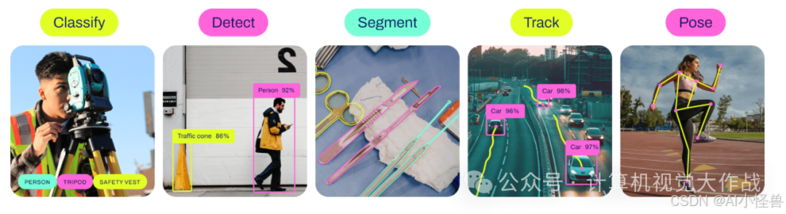
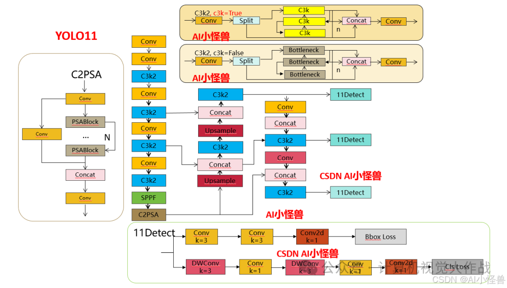
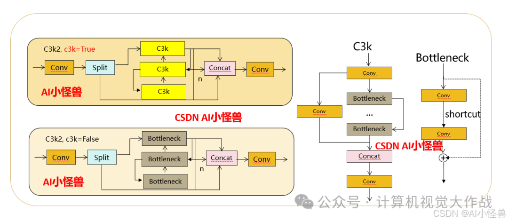
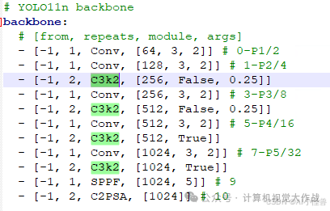
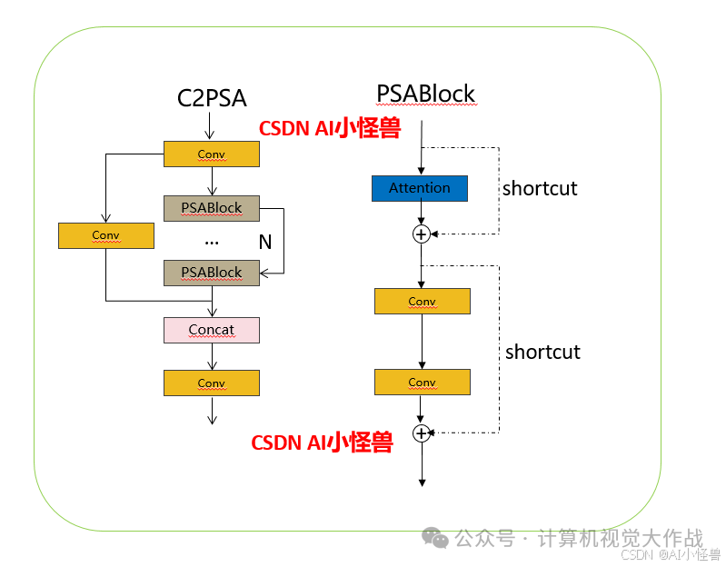
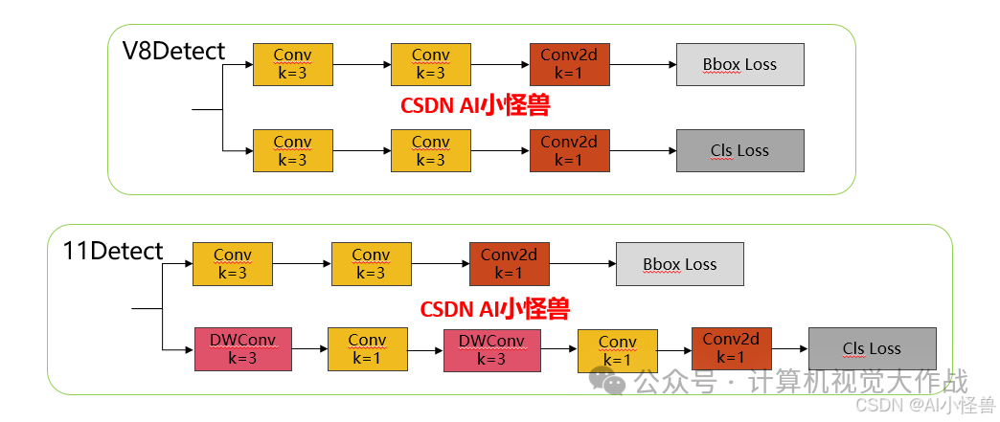
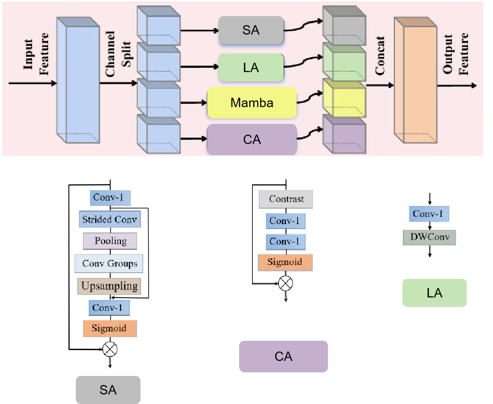
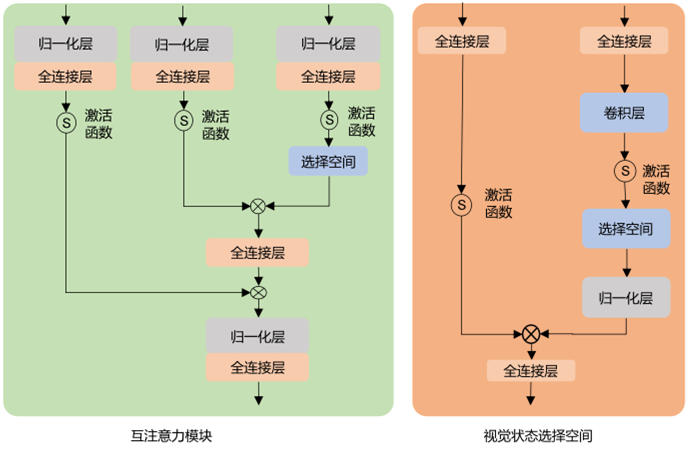

# yolo_seg
基于YOLO，修改backbone，搭建一个适用于衣服分割的轻量级分割网络！
## YOLO11

    
  Ultralytics YOLO11是一款尖端的、最先进的模型，它在之前YOLO版本成功的基础上进行了构建，并引入了新功能和改进，以进一步提升性能和灵活性。YOLO11设计快速、准确且易于使用，使其成为各种物体检测和跟踪、实例分割、图像分类以及姿态估计任务的绝佳选择。

    
  

结构图如下：

    

C3K2结构图如下：

    
  C3k2，继承自类C2f，其中通过c3k设置False或者Ture来决定选择使用C3k还是Bottleneck.

    

C3PSA结构图如下：

    

分类检测头引入了DWConv（更加轻量级，为后续二次创新提供了改进点），结构图如下（和V8的区别）：

    

# 创新点(代替C3K2)

    
  轻量级骨干网络，它包含一个新颖的轻量分组注意力（LWGA）模块。该LWGA模块能够巧妙地利用冗余特征来提取从局部到全局的广泛空间信息，而无需引入额外的复杂性或计算开销。这在一个高效的框架内促进了跨多尺度的精确特征提取。
轻量分组注意力（LWGA）机制旨在增强遥感图像中多尺度目标的表示能力。该模块在不增加空间维度的前提下，将输入特征图划分为不同的子模块，从而在多尺度特征提取与轻量计算效率之间实现了协同平衡。LWGA模块通过利用特征图固有的冗余性，对每个分区应用多种特征提取技术进行处理。这些技术包括轻量级空间注意力、轻量级局部注意力、轻量级通道注意力和轻量级全局注意力，这些子模块旨在细化对表现出大尺度变化目标的关注。随后，提取的特征被融合以优化特征表示，有效缓解了在轻量级特征提取阶段与多尺度目标识别相关的挑战。为有效提取极其微小的特征，LWGA模块集成了一个空间注意力子模块，优先处理来自微小目标的特征，保留了传统方法通常忽略的细微差别。为提取局部特征，LWGA模块集成了一个常规局部注意力子模块。借助标准卷积的固有能力，能够精准高效地提取局部特征。LWGA引入了一个通道注意力子模块。该模块结合了上下文信息，能有效保留具有不同特点的特征图的通道基本特征。此外，为在轻量约束下增强整体特征表示，LWGA模块集成了一个稀疏全局注意力子模块。该子模块引入Mamba，擅长关联远程特征，并提供强大的全局概括能力，同时其修改调整适用于资源受限的环境。LWGA模块既优化了网络辨别不同尺寸复杂细节的能力，又确保了计算需求保持在可管理的限度内，支持了资源受限环境的约束。

#轻量级mamba结构

    

# Done！
修改iMaterialist数据集格式，转为YOLO格式。
https://www.kaggle.com/datasets/sknahin/imaterialist-fashion-yolo-segmentation-dataset

# Doing!!!!
开始训练，训练YOLO11 Seg

# Resulsts
metrics.box.map: | 0.27876837981953206 
metrics.box.map50: | 0.37703568744864707 
metrics.box.map75: | 0.3010180053740146 
speed  |  13.2 ms 

